# shipnotes

Turn your git history into polished, customer-facing release notes.

<p align="center">
  
</p>

You ship constantly, but writing release notes is a chore — so the changelog
goes stale and customers never hear about improvements. `shipnotes` reads the
commits since your last release, groups them into **Breaking Changes /
Features / Fixes / Improvements**, optionally rewrites them in customer
language with Claude, and outputs Markdown or a standalone HTML page.

## Quick start

```sh
npx @mfmp17/shipnotes generate   # notes since your latest tag, to stdout
```

(Landing page:
[mfmp17.github.io/shipnotes](https://mfmp17.github.io/shipnotes/).)

## GitHub Action: a changelog PR on every release

Add one workflow and every tag you push opens a pull request that updates
`CHANGELOG.md` with that release's notes — newest release on top, re-runs
for the same tag replace its section instead of duplicating it. This repo
[dogfoods it](.github/workflows/release-notes.yml)
([example PR](https://github.com/mfmp17/shipnotes/pull/1)).

```yaml
# .github/workflows/release-notes.yml
name: Release notes
on:
  push:
    tags: ["v*"]
permissions:
  contents: write
  pull-requests: write
jobs:
  release-notes:
    runs-on: ubuntu-latest
    steps:
      - uses: actions/checkout@v4
        with:
          fetch-depth: 0 # full history + tags, not a shallow clone
      - uses: mfmp17/shipnotes@v1
        with:
          anthropic-api-key: ${{ secrets.ANTHROPIC_API_KEY }} # optional
```

One repo setting is required for the PR step: **Settings → Actions →
General → Allow GitHub Actions to create and approve pull requests**.
Leave `anthropic-api-key` out and the notes use heuristic grouping only.

Inputs: `tag` (default: the pushed tag), `since-tag` (default: the tag
before it), `changelog-file` (default `CHANGELOG.md`), `model`, `open-pr`
(set `"false"` to just generate the notes file), `base-branch`,
`github-token`. Outputs: `generated`, `notes-file`, `pr-url`.

Real output from the Express repo (heuristic mode, no API key needed):

```markdown
# express — release notes

_2026-07-12_

## Features

- Allow passing null or undefined as the value for options in app.render (#6903) (`c9ecf7b6`)
- Do not modify the Content-Type twice when sending strings (#6991) (`a479419b`)

## Fixes

- Add Content-Length header only if Transfer-Encoding is not present (#4893) (`18e5985b`)
- Bump qs minimum to ^6.14.2 for CVE-2026-2391 (#7057) (`925a1dff`)
...
```

## The LLM rewrite pass

Set `ANTHROPIC_API_KEY` and shipnotes sends the grouped entries to Claude,
which rewrites each one as a short, benefit-first sentence a non-technical
customer understands — merging duplicates and dropping entries with no
customer-visible effect. Without a key (or with `--no-llm`) you still get
clean heuristic grouping from conventional-commit prefixes and common
subject-line patterns.

```sh
export ANTHROPIC_API_KEY=sk-ant-...
shipnotes generate --since-tag v2.3.0 -o RELEASE_NOTES.md
```

## Usage

```
shipnotes generate [options]

  --since-tag <tag>   Start of the commit range (defaults to the latest tag
                      before --to, so a freshly tagged release gets its notes)
  --from <ref>        Alias for --since-tag (any git ref)
  --to <ref>          End of the commit range (default: HEAD)
  --repo <path>       Path to the git repository (default: current directory)
  --format <fmt>      Output format: md | html | json (default: md)
  -o, --output <file> Write to a file instead of stdout
  --title <title>     Notes title (default: "<repo> — release notes")
  --no-llm            Skip the Claude rewrite pass
  --model <id>        Claude model for the rewrite (default: claude-opus-4-8)
  --all               Include internal changes (chores, docs, CI)
  --no-hashes         Omit commit hashes from the output
```

`--format json` emits the same grouped notes as machine-readable JSON
(`{ title, date, sections: [{ id, title, entries }] }`) for automation such as
the GitHub Action above and the planned hosted changelog.

## How grouping works

1. **Conventional commits** (`feat:`, `fix:`, `perf:`, …) map straight to
   sections; `!` or `BREAKING CHANGE` in the body puts an entry under
   Breaking Changes.
2. **Plain subjects** are classified by common patterns ("Add…", "Fix…",
   "Support…"), and version bumps / merges / WIP commits are dropped.
3. **Internal changes** (chore, docs, ci, test) are hidden unless you pass
   `--all`.

## Development

```sh
npm install
npm test        # unit + end-to-end tests, no network required
npm run demo    # regenerate docs/demo.svg from a real CLI run
```

## License

MIT
